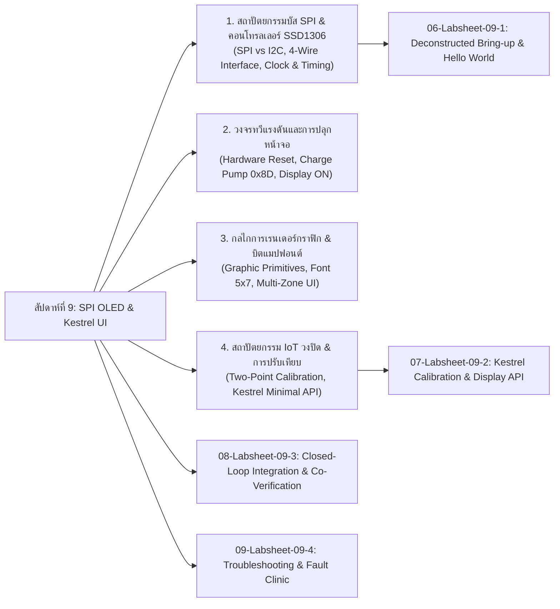

# Week 09: SPI OLED Display Architecture, 1KB Framebuffer & Edge Kestrel UI

## 1. บทนำ (Introduction)
ในสัปดาห์ที่ 9 นี้ เราจะขยายขีดความสามารถของระบบ IoT จากสัปดาห์ที่ 8 ซึ่งเราสามารถรับสัญญาณอินพุตจากตัวต้านทานปรับค่าได้ (Potentiometer) ส่งผ่านพอร์ตสื่อสารอนุกรมเข้าสู่ **Kestrel Web Server (.NET 8 Minimal API)** ได้แล้ว 

ในสัปดาห์นี้ เราจะสร้างระบบตอบสนองครบวงจร (**Full-Duplex Closed-Loop IoT System**) โดยการเพิ่มอุปกรณ์แสดงผลทางกายภาพ คือ **โมดูลหน้าจอ 0.96 นิ้ว OLED ชิปควบคุม SSD1306 แบบบัส SPI 4 สาย (4-wire SPI: GND, VCC, D0, D1, RES, DC, CS)**

แม้ว่าในท้องตลาดจะมีการระบุชื่อเรียกสับสนระหว่าง I2C และ SPI แต่เมื่อสังเกตที่แถบขาเชื่อมต่อ 7 ขา เราจะพบว่านี่คือการสื่อสารผ่านบัส **Serial Peripheral Interface (SPI)** ความเร็วสูง ซึ่งแตกต่างจากวงจรเลื่อนข้อมูลทั่วไป (เช่น Shift Register 74HC595) โดยสิ้นเชิง เนื่องจากชิป **SSD1306** มีหน่วยประมวลผลกราฟิกและหน่วยความจำแรมกราฟิกภายใน (**GDDRAM ขนาด 1,024 ไบต์**) พร้อมวงจรทวีแรงดันไฟสูง (**Internal Charge Pump 7V - 9V**)

ในบทเรียนนี้นักศึกษาจะได้เรียนรู้ตั้งแต่:
1. การควบคุมลำดับสัญญาณระดับฮาร์ดแวร์ (**Hardware Reset & Magic Init Sequence**)
2. การบริหารจัดการหน่วยความจำภาพขนาด 1 KByte บนแรมของ ESP32 ด้วยการจัดการบิต (**Bitwise Manipulation**)
3. การเรนเดอร์ตัวอักษรผ่านตารางพิกเซล (**Font Matrix Rendering**)
4. การจัดแบ่งสัดส่วนหน้าจอ (**Multi-Zone UI Layout: Header, Gauge Bar, Footer**) เพื่อเตรียมรองรับการรับคำสั่งจาก Kestrel REST API

---

## 2. แผนผังเนื้อหาการเรียนรู้ประจำสัปดาห์ (Lesson Roadmap)



---

## 3. ตารางการต่อสายฮาร์ดแวร์ (Hardware Pinout & Schematic)

### ตารางการต่อสายระหว่าง ESP32 และจอ OLED SSD1306 (7-Pin SPI)

| ขาบนโมดูล OLED | สัญญาณมาตรฐาน SPI | หน้าที่การทำงาน | ขาต่อบนบอร์ด ESP32 | หมายเหตุ |
| :---: | :---: | :--- | :---: | :--- |
| **GND** | Ground | สายดินอ้างอิงแรงดัน 0V | **GND** | ต่อร่วมกับกราวด์ระบบ |
| **VCC** | Power Supply | แรงดันไฟเลี้ยงโมดูล (3.3V) | **3.3V** | ⚠️ ห้ามต่อ 5V |
| **D0** | **SCK / SCLK** | สัญญาณนาฬิกา Master Clock | **GPIO 18** | ฮาร์ดแวร์ SPI2 (VSPI_CLK) |
| **D1** | **MOSI** | ข้อมูล Master Out $\rightarrow$ Slave In | **GPIO 23** | ฮาร์ดแวร์ SPI2 (VSPI_MOSI) |
| **RES** | **RESET** | สัญญาณรีเซ็ตระดับฮาร์ดแวร์ | **GPIO 4** | Active LOW (ดึง 0 ก่อนเริ่ม) |
| **DC** | **D/C (Data/Cmd)** | เลือกระหว่างคำสั่งและข้อมูล | **GPIO 2** | 0 = Command, 1 = RAM Data |
| **CS** | **CS / SS** | สัญญาณเลือกอุปกรณ์ Chip Select | **GPIO 5** | Active LOW (ฮาร์ดแวร์ SPI2_CS) |

### ไดอะแกรมการต่อวงจร (Circuit Schematic)

```
        ESP32 Board                             OLED SSD1306 (7-Pin SPI)
      +--------------+                            +------------------+
      |          GND |----------------------------| GND              |
      |         3.3V |----------------------------| VCC              |
      |      GPIO 18 |----------------------------| D0 (SCK)         |
      |      GPIO 23 |----------------------------| D1 (MOSI)        |
      |       GPIO 4 |----------------------------| RES (Reset)      |
      |       GPIO 2 |----------------------------| DC (Data/Cmd)    |
      |       GPIO 5 |----------------------------| CS (Chip Select) |
      +--------------+                            +------------------+

      +--------------+                             Potentiometer (10k)
      |         3.3V |----------------------------| Pin 1 (VCC)      |
      |      GPIO 34 |----------------------------| Pin 2 (Wiper)    |
      |          GND |----------------------------| Pin 3 (GND)      |
      +--------------+                            +------------------+
```

---

## 4. รายการเอกสารบทเรียนและใบงานประจำสัปดาห์

1. **[01-SPI-Protocol-and-SSD1306-Architecture.md](01-SPI-Protocol-and-SSD1306-Architecture.md)** - เปรียบเทียบบัส SPI กับ I2C, โครงสร้างฮาร์ดแวร์ 4-wire SPI, บทบาทของขา D/C และโครงสร้างแรม 1,024 ไบต์ (8 Pages)
2. **[02-SSD1306-Command-Set-and-ChargePump.md](02-SSD1306-Command-Set-and-ChargePump.md)** - เจาะลึกชุดคำสั่ง Initial Sequence, กลไกวงจร Internal Charge Pump 7-9V, โหมด Addressing (Horizontal, Page, Vertical)
3. **[03-Graphics-Rendering-Engine-and-Font-Bitmaps.md](03-Graphics-Rendering-Engine-and-Font-Bitmaps.md)** - กลไกการเรนเดอร์กราฟิกพิกเซล, ตารางบิตแมปฟอนต์ ASCII 5x7 และการแบ่งสัดส่วนหน้าจอ Multi-Zone Layout
4. **[04-Closed-Loop-IoT-Pipeline-and-Calibration.md](04-Closed-Loop-IoT-Pipeline-and-Calibration.md)** - สถาปัตยกรรม IoT วงปิดแบบ Full-Duplex, การสร้างโมเดลคณิตศาสตร์ Two-Point Calibration และการออกแบบ REST Minimal API บน Kestrel
5. **[05-Glossary.md](05-Glossary.md)** - อภิธานศัพท์และคำย่อทางเทคนิคประจำสัปดาห์ที่ 9
6. **[06-Labsheet-09-1-SPI-OLED-Deconstructed-Bringup.md](06-Labsheet-09-1-SPI-OLED-Deconstructed-Bringup.md)** - **ใบงานที่ 9.1: การประกอบสร้างตัวขับจอแสดงผล SSD1306 ทีละชิ้นส่วนสู่ Hello World พร้อมการทำ Framebuffer Forensics**
7. **[07-Labsheet-09-2-Kestrel-Calibration-and-Display-API.md](07-Labsheet-09-2-Kestrel-Calibration-and-Display-API.md)** - **ใบงานที่ 9.2: การพัฒนาเอนจินปรับเทียบเซนเซอร์และ API ควบคุมการแสดงผลบน Kestrel Web Server พร้อมการพิสูจน์หลักฐานเครือข่าย**
8. **[08-Labsheet-09-3-End-to-End-IoT-Loop-and-Verification.md](08-Labsheet-09-3-End-to-End-IoT-Loop-and-Verification.md)** - **ใบงานที่ 9.3: การบูรณาการระบบวงปิดแบบครบวงจร และการตรวจพิสูจน์ความสอดคล้องของข้อมูล (Telemetry Co-Verification)**


>[!INFO] **หมายเหตุ** 
>เนื่องจากใบงานมีสิ่งที่ต้องทำเยอะมาก ดังนั้นในสัปดาห์นี้ให้ทำของสัปดาห์ที่แล้วให้เสร็จ (ถ้ายังค้าง) 
>และให้ทำถึงใบงาน 9.2 ก่อน ส่วนใบงานที่ 9.3 และ 9.4 ยังคงต้องเพิ่มรายละเอียดเพื่อให้นักศึกษาสามารถปฏิบัติตามได้

---

## 5. อุปกรณ์ที่จำเป็นในการทดลอง (Prerequisites)

* บอร์ดไมโครคอนโทรลเลอร์ **ESP32** จำนวน 1 บอร์ด
* โมดูลจอแสดงผล **OLED 0.96" SSD1306 (7 ขา SPI)** จำนวน 1 จอ
* ตัวต้านทานปรับค่าได้ **Potentiometer 10k** จำนวน 1 ตัว
* สายเชื่อมต่อ **USB Data Cable** (Micro-USB หรือ Type-C)
* Breadboard และสายไฟจัมเปอร์ (ตัวเมีย-ตัวผู้ หรือ ผู้-ผู้) จำนวน 10-12 เส้น
* สภาพแวดล้อม **ESP-IDF v6.x** (ผ่าน Docker หรือ Native CLI)
